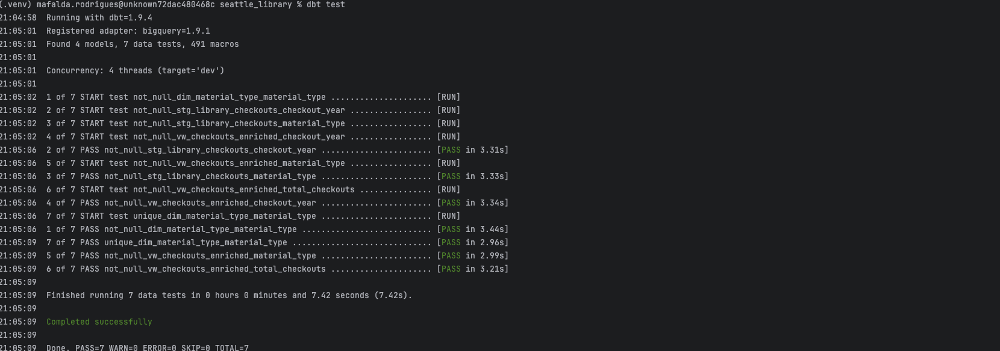

# 📚 Seattle Library Data Pipeline

## 🏩 Overview

This project implements a complete data engineering pipeline to process public checkout data from the Seattle Public Library system.  
It demonstrates modern data engineering practices, including cloud data storage, batch ingestion, data transformation, orchestration, and visualization.

The project was built as part of a data engineering course to showcase end-to-end automation on a real-world dataset.

---

## 📦 Dataset

- **Source**: [Seattle Public Library – Checkouts by Title](https://data.seattle.gov/Community-and-Culture/Checkouts-by-Title/tmmm-ytt6)
- **Description**: Records of books, eBooks, and other media checked out from Seattle Public Library branches.
- **Subset selected**:
  - **Years**: 2018, 2019, and 2020
  - **Material Types**: All types (BOOK, EBOOK, AUDIOBOOK, etc.)
  - **Fields**: Title, Creator, Material Type, Checkout Date, Checkout Year, Checkout Month, Usage Class

This subset was chosen to maintain a manageable project size while still allowing meaningful trend analysis.

---

## 🛠️ Architecture

| Component | Technology |
|:----------|:------------|
| **Data Ingestion** | Kestra (HTTP Download + GCS Upload) |
| **Data Storage** | Google Cloud Storage (GCS) |
| **Data Warehouse** | BigQuery (External Table on GCS) |
| **Orchestration** | Kestra |
| **Transformations** | dbt |
| **Infrastructure as Code** | Terraform |
| **Visualization** | Looker Studio |

---

## 🔄 Data Flow

1. **Extract** checkout records from Seattle Open Data using Kestra.
2. **Load** raw CSV files into a GCS bucket.
3. **Ingest** the raw data as an external table into BigQuery.
4. **Transform** data with dbt models (staging, fact, and dimension tables).
5. **Visualize** checkout trends in Looker Studio dashboards.

---

## 🚀 Infrastructure Deployment

### 1. Deploy Cloud Infrastructure with Terraform

The infrastructure is provisioned automatically using **Terraform**:
- A Google Cloud Storage (GCS) bucket to store the raw CSV files.
- A BigQuery dataset for external and transformed tables.

To deploy the infrastructure:
```bash
cd terraform/
./setup.sh
```

---

## 🛠️ Kestra Setup and Pipeline Execution

### 2. Start Kestra Locally
```bash
cd kestra/
docker compose up -d
```

This will start Kestra service.

### 3. Set Up Google Cloud Variables in Kestra

- Open [Kestra UI](http://localhost:8080/)
- Import the flow file [`kestra/flows/gcp_kv_library.yaml`](kestra/flows/gcp_kv_library.yaml)
- Configure the following variables:
  - `GCP_CREDS` – Path to your service account credentials or the credentials JSON content
  - `GCP_PROJECT_ID` – Your GCP project ID
  - `GCP_LOCATION` – e.g., `us-west1`
  - `GCP_DATASET` – BigQuery dataset name
  - `GCP_BUCKET_NAME` – GCS bucket name

### 4. Import and Run the Data Pipeline

- Import the main flow file [`kestra/flows/gcp_library_load.yaml`](kestra/flows/gcp_library_load.yaml)
- Run the `gcp_kv_library` flow first to load environment variables.
- Then run the `gcp_library_load` flow to ingest the data into GCS and BigQuery.

---
## 📦 dbt Transformation

### 5. Initialize and Run dbt

```bash
cd dbt/seattle_library/
dbt run
```

This will:
- Create the staging table (`stg_library_checkouts`).
- Create the fact table (`fct_checkouts`).
- Create the dimension table (`dim_material_type`).

### About the dbt Models

- **stg_library_checkouts**: This staging table cleans and standardizes the raw library checkout data. It casts data types properly (e.g., converting years and months to integers) and filters the dataset to include only records from 2018 to 2020. It prepares the dataset for analytical modeling by selecting the most relevant fields.

- **fct_checkouts**: This fact table aggregates the data to provide a summary of total checkouts. It groups records by `material_type` and `checkout_year` and calculates the number of checkouts, making it ideal for creating dashboards and year-over-year trend analysis.

- **dim_material_type**: This dimension table lists distinct material types used in checkouts, enabling cleaner joins and categorical analysis.

- **vw_checkouts_enriched**: This final view enriches the checkout fact table by joining it with usage class information from the staging layer, allowing analysis by **material category** (Physical vs Digital) as well as by material type and year.


### Data Quality Tests

To ensure the quality of the transformations, the following dbt tests were implemented:

- **Not Null tests**:
  - `material_type` and `checkout_year` in `stg_library_checkouts`
  - `material_type` and `checkout_year` in `fct_checkouts`
  - `material_type` and `usageclass` in `dim_material_type`
  - `material_type`, `material_category`, and `checkout_year` in `vw_checkouts_enriched`
- **Unique tests**:
  - `material_type` in `dim_material_type`

Running `dbt test` validates that key fields are properly populated, that no nulls exist where not allowed, and that dimension tables do not have duplicate entries.



---

## 📊 Build Dashboard

### 6. Create a Looker Studio Dashboard

The dashboard was built based on the enriched view `vw_checkouts_enriched`, allowing a richer analysis across material types, years, and usage classes.

Access the dashboard here: [Seattle Library Checkouts Dashboard](https://lookerstudio.google.com/reporting/dad59883-b052-457f-9e6b-7014782a4971)

- **Total Checkouts by Material Type** (Bar Chart)
- **Distribution of Checkouts by Material Category** (Pie Chart)
- **Detailed Table of Checkouts** (Table)
- **Distribution of Checkouts by Material Category** (Pie Chart)


## ⚡ Getting Started

To replicate the project:

1. Set up Google Cloud credentials and create a GCS bucket.
2. Deploy the infrastructure using Terraform.
3. Set up Kestra locally and configure the environment variables.
4. Import and run the Kestra flows.
5. Initialize and run dbt transformations.
6. Build the dashboard in Looker Studio.

---


# 👌 Acknowledgments

- Seattle Public Library and Seattle Open Data for providing access to the public checkout dataset.
- DataTalksClub for providing the Data Engineering Zoomcamp course and guidelines.